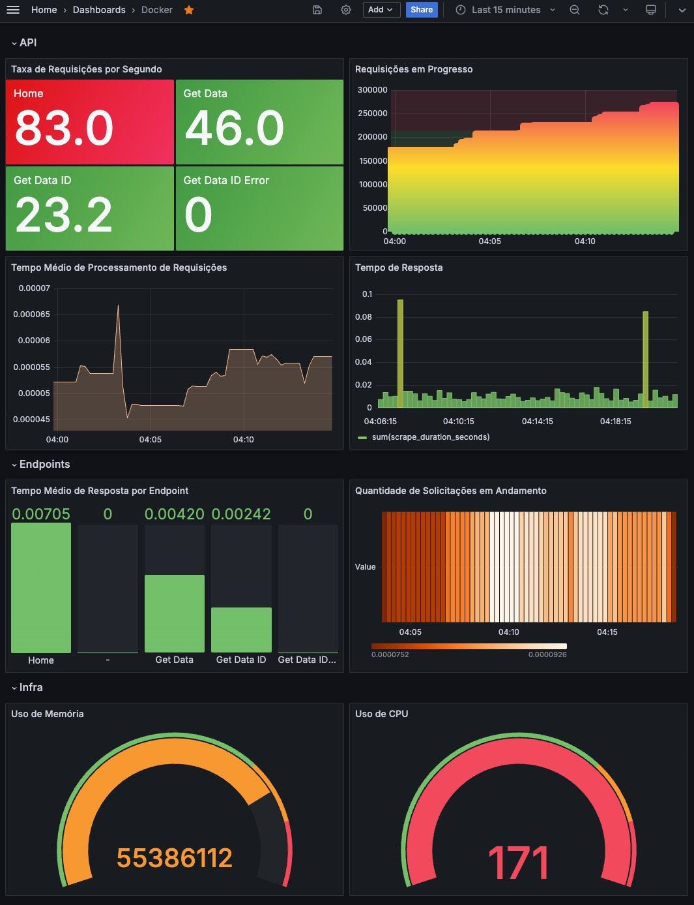

# Docker & K8s

### Aula Prática: Orquestração de Containers para uma Aplicação Web com Kubernetes

**Objetivo:** 
Demonstrar como orquestrar containers usando Kubernetes para implantar uma aplicação web simples, garantindo alta disponibilidade e escalabilidade.

**Pré-requisitos:**

1. Docker instalado.
2. Kubernetes instalado (Minikube).
3. kubectl instalado (Minikube).

**Descrição da Aplicação:**
Vamos usar uma aplicação web simples em Python com Flask, que exibe uma mensagem "Hello, World!".

### Passo 1: Criar a Aplicação Web

1. **Crie o diretório do projeto:**
   ```sh
   mkdir flask-app
   cd flask-app
   ```

2. **Crie o arquivo `app.py`:**
   ```python
   from flask import Flask

   app = Flask(__name__)

   @app.route('/')
   def hello():
       return "Hello, World!"

   if __name__ == '__main__':
       app.run(host='0.0.0.0', port=5000)
   ```

3. **Crie o arquivo `requirements.txt`:**
   ```plaintext
   Flask==2.0.1
   Werkzeug==2.0.1
   ```

### Passo 2: Dockerizar a Aplicação

1. **Crie o arquivo `Dockerfile`:**
   ```dockerfile
   # Use uma imagem base do Python
   FROM python:3.9-slim

   # Defina o diretório de trabalho
   WORKDIR /app

   # Copie os arquivos de requisitos e instale as dependências
   COPY requirements.txt requirements.txt
   RUN pip install -r requirements.txt

   # Copie o código da aplicação
   COPY app.py app.py

   # Defina o comando padrão a ser executado quando o container iniciar
   CMD ["python", "app.py"]
   ```

2. **Autentique com o Docker:**
   ```sh
   docker login
   ```

3. **Construa a imagem Docker:**
   ```sh
   docker build -t flask-app:1.0 .
   ```

4. **Teste a aplicação localmente:**
   ```sh
   docker run -p 5001:5000 flask-app:1.0
   ```
   Acesse `http://localhost:5001` para verificar se a aplicação está funcionando.

### Passo 3: Preparar os Arquivos de Configuração do Kubernetes

1. **Crie o arquivo `deployment.yaml`:**
   ```yaml
    apiVersion: apps/v1
    kind: Deployment
    metadata:
    name: flask-app-deployment
    spec:
    selector:
        matchLabels:
        app: flask-app
    replicas: 3
    template:
        metadata:
        labels:
            app: flask-app
        spec:
        containers:
            - name: flask-app
            image: flask-app:1.0
            ports:
            - containerPort: 5000
   ```

2. **Crie o arquivo `service.yaml`:**
   ```yaml
    apiVersion: v1
    kind: Service
    metadata:
    name: flask-app-service
    labels:
        name: flask-app-service
    spec:
    ports:
        - protocol: TCP
        port: 5051
        targetPort: 5000
    selector:
        app: flask-app
    type: NodePort
   ```

### Passo 4: Implantar no Kubernetes

1. **Inicie o Minikube:**
   ```sh
   minikube start
   ```

2. **Carregue a imagem Docker para o Minikube:**
   ```sh
   eval $(minikube docker-env)
   docker build -t flask-app:1.0 .
   ```

3. **Aplique as configurações do Kubernetes:**
   ```sh
   kubectl apply -f deployment.yaml
   kubectl apply -f service.yaml
   ```

4. **Verifique o status do deployment:**
   ```sh
   kubectl get deployments
   kubectl get pods
   ```

5. **Acesse a aplicação:**
   - Obtenha a URL:
     ```sh
     minikube service flask-app-service --url
     ```
   - Acesse a URL fornecido.

### Conclusão

Nesta aula prática, você aprendeu a:
1. Criar uma aplicação web simples com Flask.
2. Dockerizar a aplicação.
3. Criar arquivos de configuração do Kubernetes para deployment e serviço.
4. Implantar a aplicação no Kubernetes usando Minikube.

**Desafios adicionais:**
1. Configure um Ingress para gerenciar o tráfego.
2. Adicione uma configuração de volume persistente para armazenar dados.
3. Explore a escalabilidade alterando o número de réplicas.

### Para entender melhor

No contexto do Kubernetes, o Docker desempenha um papel crucial na criação e na execução dos containers que compõem os Pods, que são a menor unidade de implantação no Kubernetes.


### Docker:

1. **Empacotamento de Aplicativos em Containers:**
   O Docker é uma tecnologia de contêinerização que permite empacotar aplicativos e suas dependências em contêineres, garantindo que eles sejam executados de maneira consistente em qualquer ambiente. No contexto do Kubernetes, os aplicativos são empacotados em imagens Docker, que são usadas para criar e executar containers.

2. **Implantação de Contêineres no Kubernetes:**
   O Kubernetes utiliza containers Docker como a unidade básica de implantação. O Kubernetes é capaz de implantar, gerenciar e escalar esses containers de forma eficiente e automatizada.

3. **Criação de Pods:**
   No Kubernetes, um Pod é um grupo de um ou mais containers, com armazenamento e configurações de rede compartilhados. Os containers dentro de um Pod compartilham o mesmo ambiente de rede e podem se comunicar entre si usando o loopback do Pod.

4. **Kubelet e Docker:**
   O Kubelet é um componente do Kubernetes que executa em cada nó do cluster e é responsável por iniciar e monitorar os containers dentro dos Pods. O Kubelet interage diretamente com o Docker (ou outro runtime de contêiner, como containerd) para criar e gerenciar os containers conforme necessário.

5. **Portabilidade e Consistência:**
   O Docker fornece uma camada de abstração que torna os aplicativos portáteis e independentes do ambiente de execução. Isso permite que os aplicativos sejam desenvolvidos e testados localmente usando Docker e, em seguida, implantados em qualquer ambiente Kubernetes sem modificações.

O Docker desempenha um papel fundamental no processo de implantação de aplicativos no Kubernetes, fornecendo uma maneira padronizada e eficiente de empacotar, distribuir e executar aplicativos em contêineres.

## Kubernetes:

O Deployment e o Service são dois recursos fundamentais no Kubernetes que desempenham papéis diferentes, mas complementares, na implantação e na exposição de aplicativos.

### Deployment:
Um Deployment no Kubernetes é uma descrição declarativa de um conjunto de Pods, juntamente com a configuração de como eles devem ser implantados e atualizados. Ele fornece uma maneira de declarar, gerenciar e atualizar o estado desejado de uma aplicação distribuída. Aqui estão alguns pontos-chave sobre Deployments:

- **Gestão de Replicas:** O Deployment gerencia automaticamente um conjunto de réplicas de Pods, garantindo que o número especificado de Pods esteja sempre em execução.
  
- **Atualizações e Rollbacks:** Os Deployments permitem atualizações de forma controlada e rollback para versões anteriores, garantindo que a aplicação permaneça disponível durante o processo de atualização.

- **Autoreparo:** Se um Pod falhar, o Deployment irá automaticamente substituí-lo por um novo Pod saudável.

- **Rótulos e Seletores:** Os Deployments usam rótulos e seletores para definir conjuntos de Pods que compõem a aplicação. Isso permite a fácil gestão de conjuntos de Pods relacionados.

### Service:
Um Service no Kubernetes é um recurso que define uma política de acesso de rede para um conjunto de Pods. Ele fornece uma maneira estável e uniforme de acessar os Pods, independentemente de onde eles estejam implantados na infraestrutura subjacente. Aqui estão alguns pontos-chave sobre Services:

- **Descoberta de Serviços:** Um Service fornece um ponto de acesso único para um conjunto de Pods, permitindo que outros componentes do sistema os encontrem dinamicamente sem precisar conhecer os detalhes de implementação.

- **Balanceamento de Carga:** Os Services podem fornecer balanceamento de carga entre vários Pods, distribuindo o tráfego de entrada de forma equilibrada entre eles.

- **Exposição de Aplicativos:** Os Services permitem que os Pods sejam expostos para dentro ou fora do cluster Kubernetes, facilitando a exposição de aplicativos para o tráfego externo.

- **Integração de DNS:** Cada Service obtém um registro DNS automático no cluster Kubernetes, permitindo que outros serviços usem seu nome DNS para acessá-lo.

Em resumo, enquanto o Deployment gerencia a implantação e a escalabilidade dos Pods que compõem a aplicação, o Service gerencia a exposição de rede dos Pods, garantindo que eles possam ser acessados de forma confiável por outros componentes do sistema. Juntos, esses recursos fornecem uma base sólida para implantar e executar aplicativos distribuídos no Kubernetes.

## APM

Para adicionar um serviço de APM de código aberto ano projeto Flask sem usar Docker Compose, uma boa opção é usar o **Prometheus** para monitoramento e o **Grafana** para visualização. Vamos configurar essas ferramentas manualmente.

### Passo 1: Configurar o Prometheus

1. **Instalar o Prometheus:**

   Baixe e instale o Prometheus  seguindo as instruções no [site oficial](https://prometheus.io/download/).


2. **Configurar o Prometheus:**

   Crie um arquivo de configuração para o Prometheus (`prometheus.yml`):

   ```yaml
   global:
     scrape_interval: 15s

   scrape_configs:
     - job_name: 'flask-app'
       static_configs:
         - targets: ['localhost:8000']
   ```

3. **Iniciar o Prometheus:**

   Execute o Prometheus com a configuração criada:

   ```sh
   prometheus --config.file=prometheus.yml
   ```

### Passo 2: Configurar o Flask para Exportar Métricas

1. **Atualizar o Código do Flask:**

   Modifique o `app.py` para expor as métricas do Prometheus:

   ```python
   from flask import Flask, request
   from prometheus_flask_exporter import PrometheusMetrics

   app = Flask(__name__)
   metrics = PrometheusMetrics(app)

   # Exemplo de métrica personalizada por endpoint
   metrics.info('app_info', 'Application info', version='1.0.0')

   @app.route('/')
   def hello():
      return "Hello, World!"

   @app.route('/personagens', methods=['GET'])
   def get_personagens():
      return jsonify(db)

   @app.route('/personagens/<int:id>', methods=['GET'])
   def get_personagem(id):
      personagem = next((p for p in db if p["id"] == id), None)
      return jsonify(personagem) if personagem else ("Not Found", 404)

   @app.route('/personagens', methods=['POST'])
   def create_personagem():
      new_personagem = request.json
      db.append(new_personagem)
      return jsonify(new_personagem), 201

   @app.route('/personagens/<int:id>', methods=['PUT'])
   def update_personagem(id):
      personagem = next((p for p in db if p["id"] == id), None)
      if personagem:
         personagem.update(request.json)
         return jsonify(personagem)
      return ("Not Found", 404)

   @app.route('/personagens/<int:id>', methods=['DELETE'])
   def delete_personagem(id):
      global db
      db = [p for p in db if p["id"] != id]
      return ("", 204)

   if __name__ == '__main__':
      app.run(host='0.0.0.0', port=5000)

   ```

2. **Reconstruir e Executar o Container:**

   Reconstrua e execute a imagem Docker:

   ```sh
   docker build -t flask-app:1.0 .
   docker run -p 5001:5000 -p 8000:8000 flask-app:1.0
   ```

### Passo 3: Configurar o Grafana

1. **Instalar o Grafana:**

   Baixe e instale o Grafana seguindo as instruções no [site oficial](https://grafana.com/grafana/download).


2. **Iniciar o Grafana:**

   Execute o Grafana:

   ```sh
   services start grafana
   ```

3. **Configurar o Grafana:**

   - Acesse o Grafana no navegador em `http://localhost:3000`.
   - Faça login com as credenciais padrão (usuário: `admin`, senha: `admin`).
   - Adicione um novo Data Source:
     - Vá para `Configuration > Data Sources > Add data source`.
     - Selecione `Prometheus`.
     - Configure a URL do Prometheus como `http://localhost:9090`.
     - Clique em `Save & Test`.

4. **Criar um Dashboard:**

   - Vá para `Create > Dashboard`.
   - Adicione um novo painel (Panel):
     - Selecione a métrica que deseja visualizar (`request_count`, `request_processing_seconds`, etc.).
     - Configure o gráfico de acordo com suas necessidades.
   - Salve o dashboard.

### Passo 4: Verificar a Configuração

1. **Verificar se o Prometheus está Coletando Métricas:**

   Acesse o Prometheus em `http://localhost:9090` e verifique se as métricas estão sendo coletadas.

2. **Visualizar Métricas no Grafana:**

   Acesse o Grafana em `http://localhost:3000` e veja se o dashboard está exibindo as métricas corretamente.


Aqui estão alguns exemplos de consultas Prometheus (PromQL) que você pode usar para monitorar o seu aplicativo Flask:

### Contagem Total de Requisições

Para obter o número total de requisições processadas pela aplicação:

```promql
request_count_total
```

### Tempo Médio de Processamento de Requisições

Para calcular o tempo médio de processamento das requisições:

```promql
rate(request_processing_seconds_sum[1m]) / rate(request_processing_seconds_count[1m])
```

### Requisições em Progresso

Para obter o número atual de requisições em progresso:

```promql
inprogress_requests
```

### Taxa de Requisições por Segundo

Para obter a taxa de requisições processadas por segundo nos últimos 5 minutos:

```promql
rate(request_count_total[5m])
```

### Tempo Percentil 95 de Processamento de Requisições

Para calcular o tempo de processamento no percentil 95 das requisições:

```promql
histogram_quantile(0.95, sum(rate(request_processing_seconds_bucket[5m])) by (le))
```

### Uso de CPU por Container

Para obter o uso de CPU por container (se você estiver coletando métricas de CPU do seu ambiente):

```promql
sum(rate(container_cpu_usage_seconds_total[1m])) by (container_label_io_kubernetes_pod_name)
```

### Uso de Memória por Container

Para obter o uso de memória por container (se você estiver coletando métricas de memória do seu ambiente):

```promql
sum(container_memory_usage_bytes) by (container_label_io_kubernetes_pod_name)
```

### Requisições com Erros

Para obter a contagem de requisições que resultaram em erro (supondo que você esteja registrando erros em uma métrica separada):

```promql
rate(request_errors_total[5m])
```

### Exemplo de Configuração para Grafana

Para usar essas consultas no Grafana, você pode criar painéis (dashboards) e adicionar gráficos (panels) com essas consultas. Aqui estão os passos básicos:

1. **Adicionar um Painel no Grafana:**
   - No Grafana, vá para `Create > Dashboard`.
   - Clique em `Add new panel`.

2. **Configurar a Consulta:**
   - Na seção `Query`, selecione seu data source Prometheus.
   - Insira uma das consultas Prometheus mencionadas acima na caixa de consulta.

3. **Configurar o Gráfico:**
   - Personalize o gráfico conforme necessário (e.g., título, eixos, intervalos de tempo).
   - Clique em `Apply` para salvar o painel.

### Exemplo de Consulta no Grafana

Aqui está um exemplo de consulta no Grafana usando a métrica `request_count_total`:

1. **Consulta:**
   ```promql
   rate(request_count_total[5m])
   ```

O Grafana é uma ferramenta poderosa para visualização de dados e pode se conectar a vários backends de dados, incluindo Prometheus. Abaixo estão alguns exemplos de consultas Grafana (escritas em PromQL) que você pode usar para monitorar métricas comuns em um ambiente de produção.

### Consultas de Grafana usando PromQL

#### 1. Contagem Total de Requisições

Para obter o número total de requisições processadas pela aplicação:

```promql
sum(request_count_total)
```

#### 2. Taxa de Requisições por Segundo

Para obter a taxa de requisições processadas por segundo nos últimos 5 minutos:

```promql
rate(request_count_total[5m])
```

#### 3. Tempo Médio de Processamento de Requisições

Para calcular o tempo médio de processamento das requisições:

```promql
rate(request_processing_seconds_sum[5m]) / rate(request_processing_seconds_count[5m])
```

#### 4. Uso de CPU por Container

Para obter o uso de CPU por container:

```promql
sum(rate(container_cpu_usage_seconds_total[5m])) by (container_label_io_kubernetes_pod_name)
```

#### 5. Uso de Memória por Container

Para obter o uso de memória por container:

```promql
sum(container_memory_usage_bytes) by (container_label_io_kubernetes_pod_name)
```

#### 6. Requisições com Erros

Para obter a contagem de requisições que resultaram em erro:

```promql
rate(request_errors_total[5m])
```

#### 7. Tempo Percentil 95 de Processamento de Requisições

Para calcular o tempo de processamento no percentil 95 das requisições:

```promql
histogram_quantile(0.95, sum(rate(request_processing_seconds_bucket[5m])) by (le))
```

#### 8. Número de Pods por Estado

Para visualizar quantos pods estão em diferentes estados (Running, Pending, etc.):

```promql
count(kube_pod_status_phase{phase="Running"})
```

#### 9. Latência Média das Requisições HTTP

Para obter a latência média das requisições HTTP:

```promql
histogram_quantile(0.5, sum(rate(http_request_duration_seconds_bucket[5m])) by (le))
```

#### 10. Número de Pods Reiniciados

Para visualizar o número de pods que foram reiniciados:

```promql
sum(kube_pod_container_status_restarts_total)
```

### Passo a Passo para Usar as Consultas no Grafana

1. **Adicionar um Painel no Grafana:**
   - No Grafana, vá para `Create > Dashboard`.
   - Clique em `Add new panel`.

2. **Configurar a Consulta:**
   - Na seção `Query`, selecione seu data source Prometheus.
   - Insira uma das consultas Prometheus mencionadas acima na caixa de consulta.

3. **Configurar o Gráfico:**
   - Personalize o gráfico conforme necessário (e.g., título, eixos, intervalos de tempo).
   - Clique em `Apply` para salvar o painel.

### Exemplo Visual no Grafana

1. **Configurar o Data Source:**
   - Vá para `Configuration > Data Sources > Add data source`.
   - Selecione `Prometheus`.
   - Configure a URL como `http://localhost:9090` (ou onde o Prometheus está rodando).

2. **Adicionar o Painel:**
   - Vá para `Create > Dashboard`.
   - Clique em `Add new panel`.
   - Insira a consulta `rate(request_count_total[5m])`.
   - Personalize o gráfico e clique em `Apply`.

3. **Visualizar o Dashboard:**
   - No dashboard, você verá a taxa de requisições por segundo visualizada como um gráfico de séries temporais.

### Exemplos de Consultas em Painéis

#### Painel de Requisições por Segundo

- **Título:** `Requisições por Segundo`
- **Consulta:**
  ```promql
  rate(request_count_total[5m])
  ```

#### Painel de Uso de CPU

- **Título:** `Uso de CPU por Pod`
- **Consulta:**
  ```promql
  sum(rate(container_cpu_usage_seconds_total[5m])) by (container_label_io_kubernetes_pod_name)
  ```

#### Painel de Latência

- **Título:** `Latência Média das Requisições HTTP`
- **Consulta:**
  ```promql
  histogram_quantile(0.5, sum(rate(http_request_duration_seconds_bucket[5m])) by (le))
  ```

### Dashboard no Grafana

Confira como ficou o dashboard no Grafana

